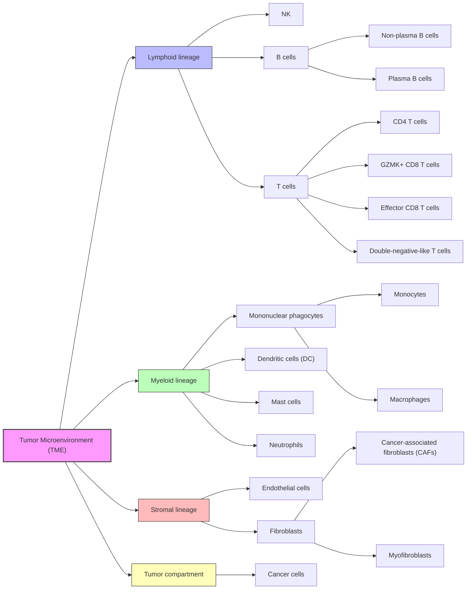

# VAEDecon

**Cell-type-specific gene expression deconvolution by a single-cell generative model**

VAEDecon is a deep learning framework for deconvolving bulk gene expression
profiles into cell-type proportions and cell-type-specific gene expression
profiles. The current `main` branch uses a staged workflow to reduce the
difficulty of optimizing cell-proportion inference and cell-type-specific gene
expression reconstruction jointly from the beginning, where both tasks can
have large errors. By separating cell-proportion learning, reconstruction
learning, and joint fine-tuning, the workflow helps balance inference
accuracy for both cell proportions and cell-type-specific expression
profiles.

## Features

- **Three-stage training workflow** for cell-proportion predictor pretraining,
  cell-type-specific gene expression profile (GEP) reconstruction training,
  and joint fine-tuning
- **Dedicated DeSide-style predictor branch** for cell-proportion
  learning in Stage 1
- **Multi-encoder VAE backbone** with `EncoderMLP`, `EncoderResMLP`,
  `GeneTransformerEncoder`, `EncoderPathNet`, `EncoderSGNN`, and
  `EncoderHybrid`
- **Inter-sample similarity loss** preserves sample-level variation within the
  same cell type so reconstructed cell-type-specific GEPs do not collapse to
  an over-smoothed average.
- **Hierarchy-aware repulsion loss** separates the latent embeddings of
  different cell types while preserving the hierarchy described in
  [Hierarchical structure of cell types](#hierarchical-structure-of-cell-types).
- **Residual GEP learning** lets the model predict sample-specific deviations
  around the average GEP profile of each cell type instead of learning only a
  single fixed profile.

## Installation

### Install from source

From the repository root:

```bash
conda create -n vaedecon python=3.12
conda activate vaedecon

# PyTorch
# For Linux or Windows with CUDA, install a compatible CUDA build first.
pip install torch==2.11.0 torchvision==0.26.0

# Install VAEDecon in editable mode
pip install -e .

```

### Install the packaged release

```bash
pip install vaedecon
```

## Quick start

### 1. Train a model

You can train from a YAML file or a `VAEDeconConfig` object.

**Using a YAML config file**

```python
from vaedecon.workflow import train_vaedecon

final_config = train_vaedecon(
    config_file="vaedecon/configs/example_config.yaml"
)

print(final_config.model.model_dir)
```

**Using a Python config object**

```python
from vaedecon.workflow import train_vaedecon
from vaedecon.configs import VAEDeconConfig

config = VAEDeconConfig()
config.training.num_epochs = 100
config.model.latent_dim = 48
config.model.encoders = ["EncoderMLP"]

final_config = train_vaedecon(config=config)
print(final_config.model.model_dir)
```

### 2. Run inference on one dataset

```python
from vaedecon.workflow import predict_vaedecon

results = predict_vaedecon(
    model_dir="./output/vae/my_run/final_model",
    data_file_path="./datasets/test_data.h5ad",
    visualize=True,
)

print(results["pred_cell_prop"].shape)
```

### 3. Run inference for all configured test sets

If `data_file_path` is omitted, `predict_vaedecon()` uses
`config.data.test_sets`.

```python
from vaedecon.workflow import predict_vaedecon
from vaedecon.configs import VAEDeconConfig

config = VAEDeconConfig.from_yaml("vaedecon/configs/example_config.yaml")

all_results = predict_vaedecon(
    model_dir="./output/vae/my_run/final_model",
    config=config,
    data_file_path=None,
    visualize=True,
)
```

## Staged training workflow

The current code base supports staged training through
`training.staged_training`.

The configured stage names are currently:

1. `cell_prop_predictor_pretrain`
2. `reconstruction_training`
3. `joint_finetune`

These stages define the staged workflow on `main`:

1. **Stage 1: `cell_prop_predictor_pretrain`**
   Train the optional dedicated predictor branch so cell proportions stabilize
   before reconstruction learning.
2. **Stage 2: `reconstruction_training`**
   Train the encoder and decoder while freezing the dedicated predictor
   branch for cell-type-specific gene expression profile (GEP) reconstruction from the input mixed bulk data.
3. **Stage 3: `joint_finetune`**
   Fine-tune the cell proportion predictor branch, encoders, and decoder together using a smaller learning rate.

The staged-training validator enforces the canonical contiguous order:

```text
cell_prop_predictor_pretrain -> reconstruction_training -> joint_finetune
```

### Minimal staged-training example

```yaml
training:
  staged_training:
    enabled: true
    run_stages:
      - cell_prop_predictor_pretrain
      - reconstruction_training
      - joint_finetune
    stage_init_checkpoints: {}
    stages:
      - name: cell_prop_predictor_pretrain
        max_epochs: 300
        train_modules: ["cell_prop_predictor"]
        freeze_modules: ["encoders", "decoder"]
        learning_rate_scale: 1.0
        loss_overrides:
          cell_prop: 1.0e4
          cell_type_sct_gep_weight: 0.0
          hierarchical_code_weight: 0.0
          cross_sample_gene_var_weight: 0.0
        early_stopping:
          monitor: "val_cell_prop_loss"
          patience: 30
          min_delta: 0.0
      - name: reconstruction_training
        max_epochs: 500
        train_modules: ["encoders", "decoder"]
        freeze_modules: ["cell_prop_predictor"]
        learning_rate_scale: 1.0
        loss_overrides:
          cell_prop: 0.0
        early_stopping:
          monitor: "val_loss"
          patience: 50
          min_delta: 0.0
      - name: joint_finetune
        max_epochs: 100
        train_modules: ["cell_prop_predictor", "encoders", "decoder"]
        freeze_modules: []
        learning_rate_scale: 0.1
        early_stopping:
          monitor: "val_loss"
          patience: 20
          min_delta: 0.0
```

Each staged run writes per-stage outputs and a
`staged_training_summary.csv` artifact.

## Stage 1 cell-proportion prediction and DeSide

VAEDecon uses `DeSideCellPropPredictor` in Stage 1 for cell-proportion
prediction and bulk-context extraction before reconstruction training.
Stage 1 (`cell_prop_predictor_pretrain`) is therefore the dedicated
cell-proportion learning stage in the staged workflow.

The Stage 1 cell-proportion predictor follows **DeSide**:

- X. Xiong, Y. Liu, D. Pu, Z. Yang, Z. Bi, L. Tian, & X. Li, DeSide: A unified deep learning approach for cellular deconvolution of tumor microenvironment, Proc. Natl. Acad. Sci. U.S.A. 121 (46) e2407096121, https://doi.org/10.1073/pnas.2407096121 (2024).

## Data and configuration

VAEDecon uses one YAML configuration file to control data loading, staged
training, model architecture, loss terms, and evaluation outputs. In practice,
you will mainly edit the `data`, `training`, `model`, and `evaluation`
sections.

For detailed configuration options and workflow notes, see:

- `vaedecon/configs/example_config.yaml`
- `docs/configuration.md`
- `docs/superpowers/specs/`


## Examples

See the `examples/` directory for runnable scripts:

- `examples/train_example.py`
- `examples/inference_example.py`

## Hierarchical structure of cell types


