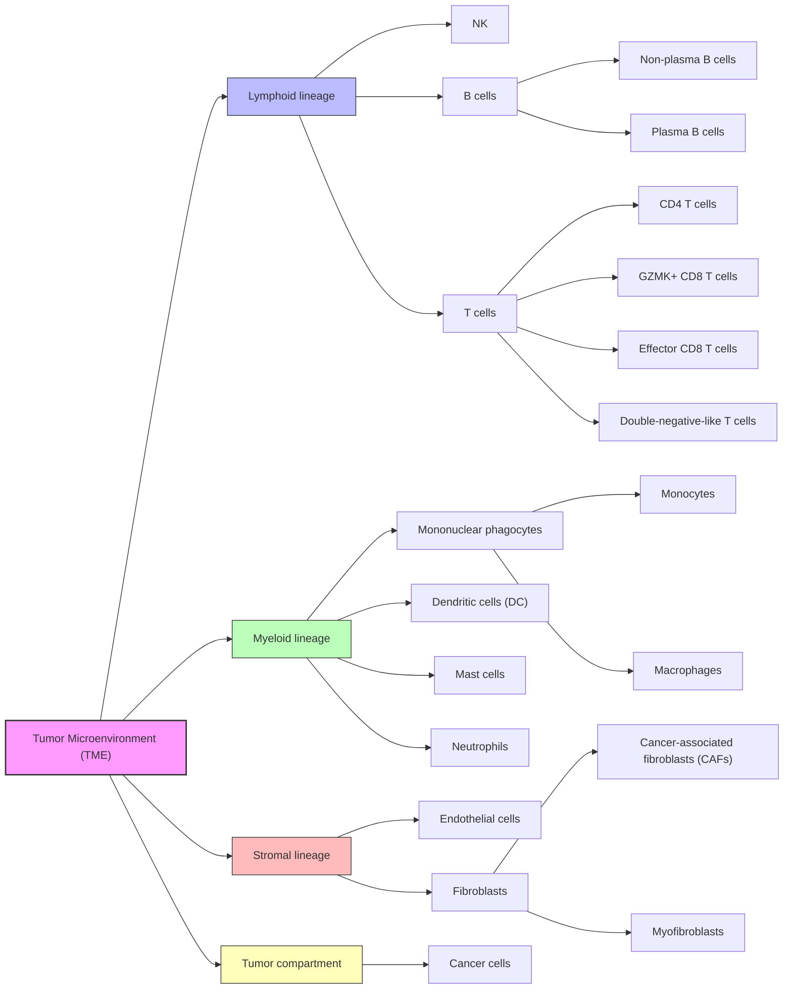

# VAEDecon

**Gene expression deconvolution by single cell generative model**

VAEDecon is a deep learning-based tool for deconvolving bulk gene expression profiles (GEPs) into cell-type-specific GEPs. It leverages a Variational Autoencoder (VAE) trained on single-cell-type RNA-seq (sctRNA-seq) and simulated bulk RNA-seq data to learn cell-type-specific representations and estimate the expression patterns of each composition of bulk tissues, such as the tumor microenvironment.

## Features
- **Generative Modeling**: Uses VAEs to reduce the high-dimensionality and decompose bulk GEPs in the latent space to create a compact representation for each cell type's GEPs.
- **Multi-Encoder Support**: Supports MLP, Residual MLP, Transformer, and GNN encoders.
- **Hybrid Fusion**: Combines different encoders using Product of Experts (PoE) for robust representations.
- **Visualization**: Built-in tools for plotting cell proportions, latent spaces, and gene expression profiles.

## Installation

```bash
# conda is recommended
conda create -n vaedecon python=3.12
conda activate vaedecon

# Install PyTables
conda install -c conda-forge hdf5 pytables=3.10.2

# Install PyTorch
# if you have a GPU, install pytorch with CUDA support first
# For linux or Windows, please refer to https://pytorch.org/get-started/previous-versions/
pip install torch==2.11.0 torchvision==0.26.0 --index-url https://download.pytorch.org/whl/cu126
# For Mac OS
pip install torch==2.11.0 torchvision==0.26.0

# Install VAEDecon
pip install vaedecon
```

## Quick Start

### 1. Training a Model

You can train a model using the `train_vaedecon` function. It supports configuration via a YAML file or a Python object.

**Using a Configuration File:**
```python
from vaedecon.workflow import train_vaedecon

# Train using the packaged example config
import importlib.resources as resources
import yaml
from vaedecon.configs import VAEDeconConfig

example_cfg = resources.files("vaedecon.configs").joinpath("example_config.yaml").read_text()
config = VAEDeconConfig.from_dict(yaml.safe_load(example_cfg))
model_dir = train_vaedecon(config=config)
print(f"Model saved to: {model_dir}")
```

**Using a Python Configuration Object:**
```python
from vaedecon.workflow import train_vaedecon
from vaedecon.configs import VAEDeconConfig

config = VAEDeconConfig()
config.training.num_epochs = 100
config.model.latent_dim = 10

model_dir = train_vaedecon(config=config)
```

### 2. Inference (Prediction)

Once you have a trained model, you can use `predict_vaedecon` to estimate cell proportions in new bulk data.

```python
from vaedecon.workflow import predict_vaedecon

results = predict_vaedecon(
    model_dir='./output/vae/final_model',  # Path to your trained model
    data_file_path='./datasets/test_data.h5ad',  # Path to bulk data
    visualize=True  # Generate plots automatically
)

print(f"Predicted cell proportions shape: {results['pred_cell_prop'].shape}")
```

## Data Format

- **Single-Cell Data**: Should be provided as `.h5ad` files (AnnData) containing raw counts or log-normalized expression.
- **Bulk Data**: Can be `.h5ad` or `.csv` files. Rows should represent samples and columns should represent genes.

## Configuration

The `VAEDeconConfig` object controls all aspects of the pipeline. Key sections include:
- `data`: Paths to datasets and preprocessing options.
- `model`: Network architecture (encoders, latent dimensions, loss coefficients).
- `training`: Batch size, learning rate, epochs, device selection.
- `evaluation`: Visualization settings and metrics.

See `configs/example_config.yaml` for a complete example.

## How cell proportions are learned

`VAEDecon` can either use known cell fractions during training or learn to
predict them from bulk expression. The behavior is controlled by
`model.predict_cell_prop`, `model.loss_coefficient.cell_prop`, and
`model.loss_coefficient.kld_p`.

When you enable cell proportion prediction with `predict_cell_prop: true`, the
active encoder adds a cell proportion head that outputs a positive concentration
vector `dd_alpha` for each sample. The model then uses that vector in three
ways:

1. It converts `dd_alpha` to the deterministic Dirichlet mean
   `dd_alpha / sum(dd_alpha)` for the forward cell-proportion output.
2. It uses the predicted proportions to weight the reconstructed
   cell-type-specific GEPs when rebuilding the bulk profile.
3. It can regularize `dd_alpha` with a Dirichlet KL term and compare the
   Dirichlet mean against known training-set cell fractions through the
   supervised `cell_prop` loss term.

To train this branch with direct supervision and optional Dirichlet
regularization, set these options:

```yaml
model:
  predict_cell_prop: true
  loss_coefficient:
    kld_p: 0.1
    cell_prop: 1.0
```

When `predict_cell_prop: true` and `loss_coefficient.cell_prop > 0`, the
training dataset must include cell fraction labels. During inference, labels are
not required. The trained model predicts cell proportions directly from bulk
expression, saves them to `predicted_cell_prop.csv`, and reports the
deterministic Dirichlet mean instead of a sampled composition vector.

## How the Dirichlet distribution is used

The Dirichlet distribution gives the model a natural way to represent cell
fractions because it produces positive vectors that sum to one. In
`VAEDecon`, the encoder does not predict proportions directly. Instead, it
predicts the Dirichlet concentration parameters `dd_alpha`, using a `softplus`
layer so every entry stays positive.

This design lets the model represent both the estimated composition and its
concentration pattern across cell types:

- larger `dd_alpha` values indicate stronger concentration on specific
  proportions
- the normalized vector `dd_alpha / sum(dd_alpha)` gives the mean-style
  proportion estimate used for both forward prediction and supervision

The VAE code also computes a KL divergence between `Dirichlet(dd_alpha)` and a
uniform Dirichlet prior and reports it as `kld_p`. You can control the strength
of that regularization with `loss_coefficient.kld_p`. The supervised training
path uses `loss_coefficient.cell_prop` to match the Dirichlet mean to known
training fractions when labels are available.

## Examples

Check the `examples/` directory for complete scripts:
- `examples/train_example.py`: Various ways to configure and run training.
- `examples/inference_example.py`: Batch prediction, visualization, and TCGA analysis.

## Hierarchical Structure of cell types


